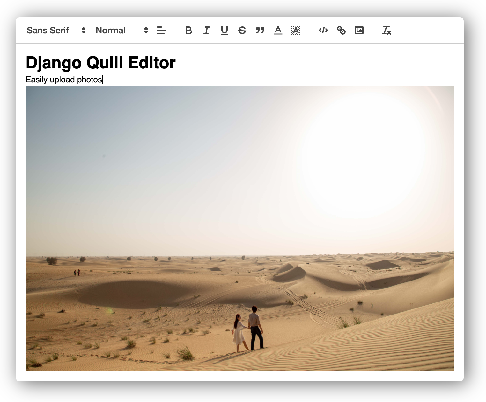

django-quill-editor
========================================
django-quill-editor makes `Quill.js` easy to use on Django Forms and admin sites

.. _Quill.js: https://quilljs.com/

* **No configuration required for static files!**
* The entire code for inserting WYSIWYG editor is less than 30 lines
* It can be used in both admin and Django views

.. toctree::
   :maxdepth: 4
   :glob:

   pages/using-in-admin
   pages/using-as-form
   pages/using-as-modelform
   pages/image-uploads
   pages/change-toolbar-configs

Installation
************

Use pip to install from PyPI::

    pip install django-quill-editor

Add **django_quill** to **INSTALLED_APPS** in **settings.py**::

    INSTALLED_APPS = [
        'django.contrib.admin',
        ...
        'django_quill',
    ]

Contributing
************

To contribute to **django-quill-editor** `create a fork`_ on GitHub. Clone your fork, make some changes, and submit a pull request.

.. _create a fork: https://github.com/leehanyeong/django-quill-editor

Issues
******

Use the GitHub `issue tracker`_ for **django-quill-editor** to submit bugs, issues, and feature requests.

.. _issue tracker: https://github.com/leehanyeong/django-quill-editor/issues

Indices and tables
==================

* :ref:`genindex`
* :ref:`modindex`
* :ref:`search`
